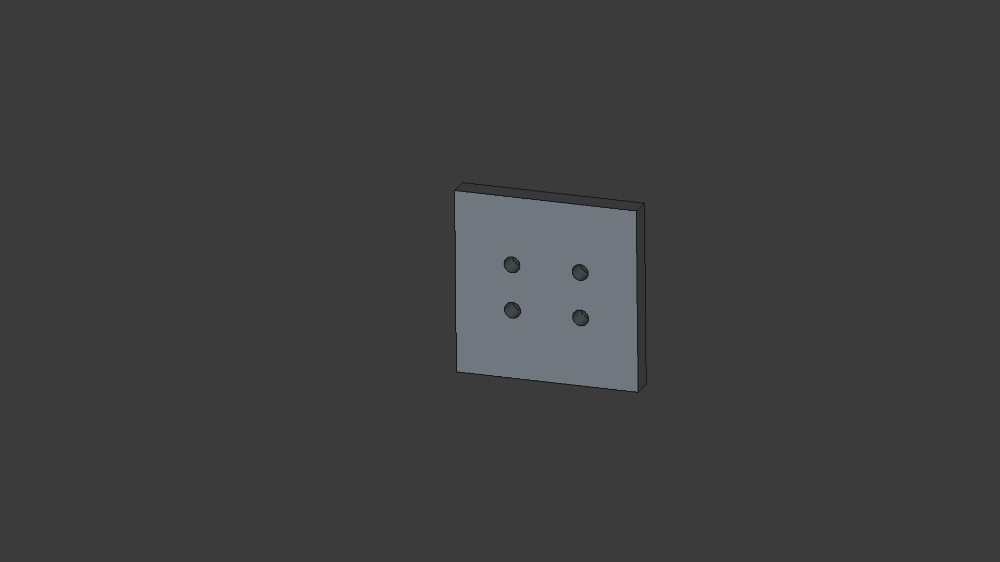
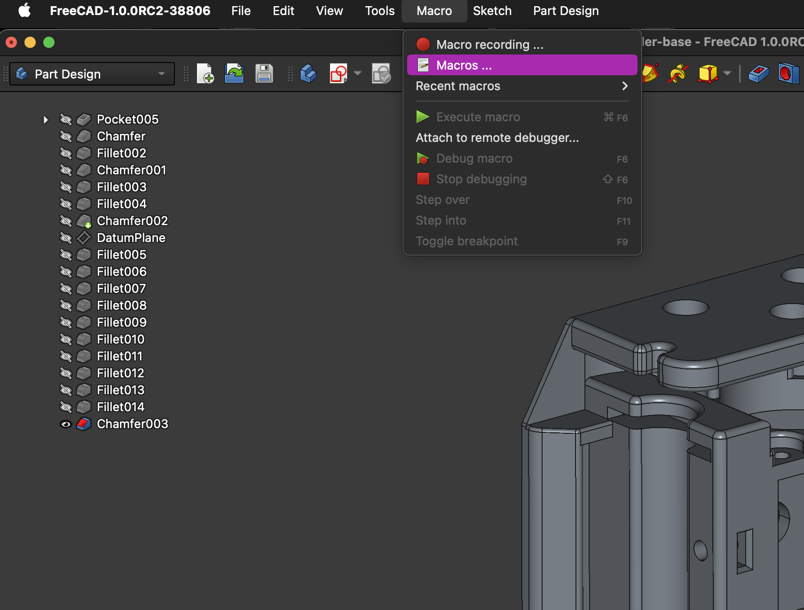
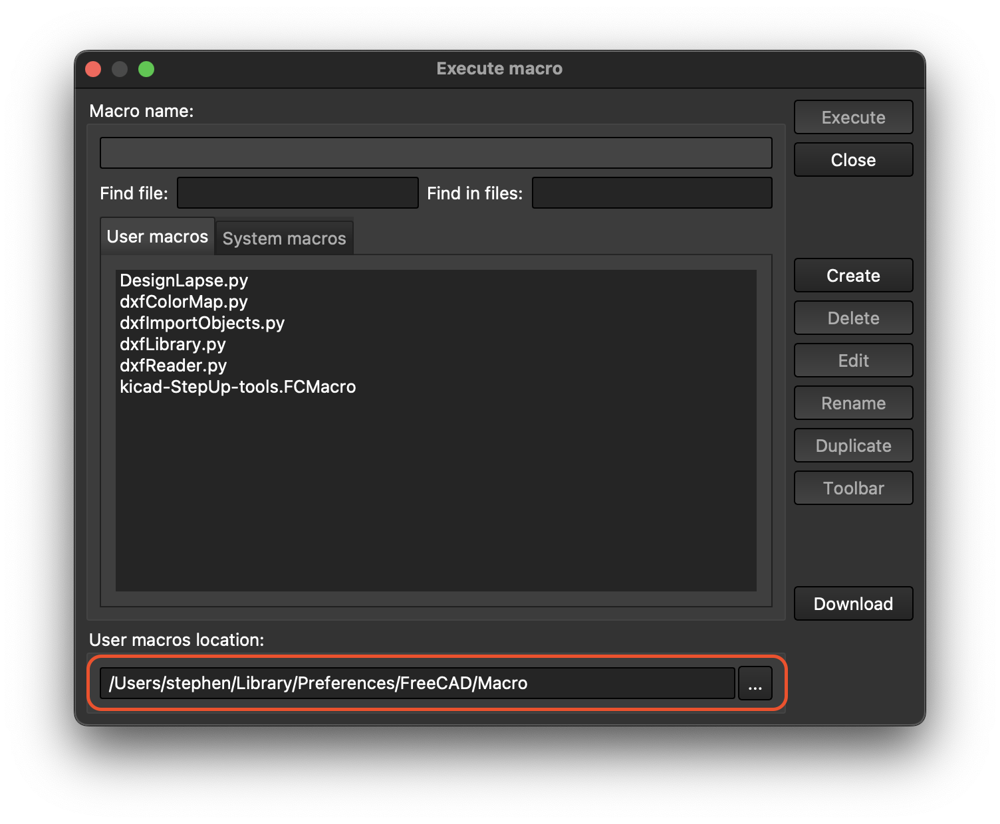
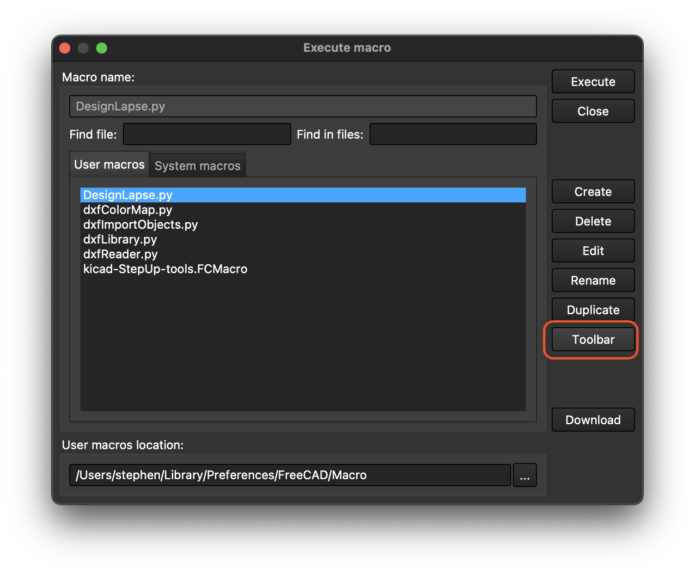

# DesignLapse

DesignLapse is a FreeCAD Macro to generate design timelapse gifs.

## Installation

1. Make sure you're running at least v1.0.0RC2 of FreeCAD
2. Download the `DesignLapse.py` file from this repo
3. Open FreeCAD and go to `Macro -> Macros ...`
	
4. Move `DesignLapse.py` to the path at the bottom of the popup.
	
5. Reopen the popup, select `DesignLapse.py`, click the Toolbar button, and follow the wizard to add the macro to your toolbar.
	
6. Click the toolbar button to open the settings dialogue and run the macro.

## Notes
- The resulting gif will be in the same directory as your design file, with the same name.
- The tool is meant for parts designed in the PartDesign Workbench
- The tool depends on the fact that the part is modeled in a body named `Body`.
- The tool uses the current viewport orientation as a starting place. Make sure to adjust this before running the tool.
- The tool currently only rotates about the Z axis.